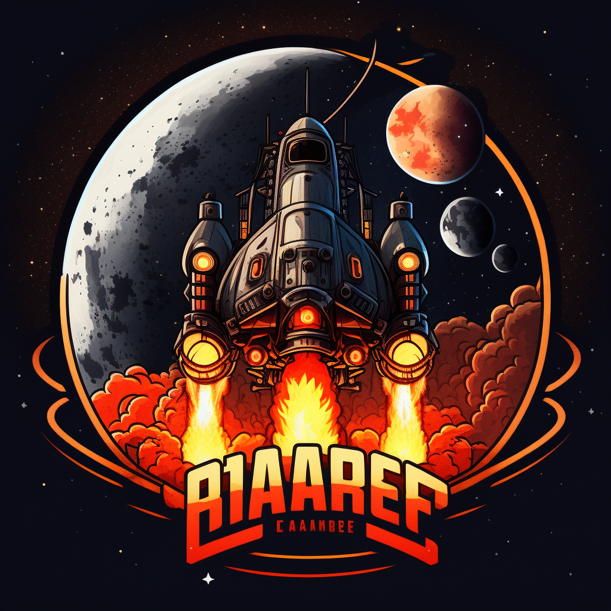
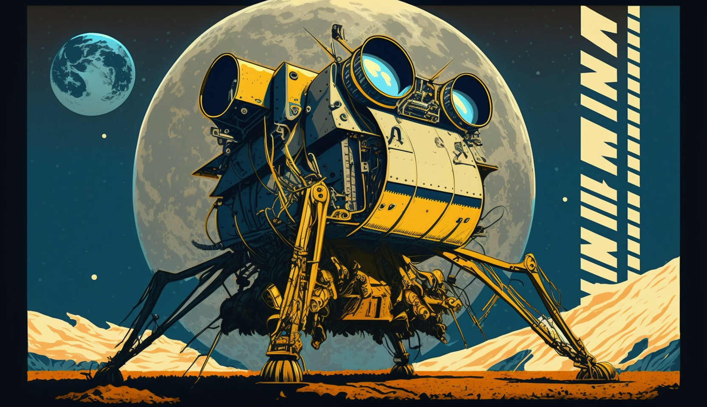

# Lunar Lander 🧑‍🚀🚀



Un *Coding Contest* en mode *Bot Battle*.

Qui arrivera à faire atterir son vaisseau le premier sans l'exploser ?

## Mise en place

Quelqu'un doit faire office de serveur, et doit le lancer sur sa machine.

```shell
cd server
npm install
npm start
```

- Vérifier que le serveur tourne bien en allant sur `http://localhost:4000`  
- Vérifiez que tous les clients peuvent accéder au serveur sur l'URL : `IP_DE_LA_MACHINE_SERVEUR:4000`
  - ℹ️ l'IP locale du serveur se trouve en bas à droite de la page

Ensuite, chaque client doit lancer son programme :
```shell
cd client
npm install
...
# penser à mettre à jour cette ligne en haut de app.ts
const SERVER_URL = process.env.SERVER_URL || 'http://127.0.0.1:4000';
...
npm run dev
```
L'application redémarrera automatiquement à chaque modification dans le code.

Chaque client peut customiser son vaisseau avec un nom, un [emoji](https://emojipedia.org/) et une [couleur](https://www.colorhexa.com/) : 

```javascript
const PLAYER_NAME = process.env.PLAYER_NAME || 'NO_NAME';
const PLAYER_EMOJI = process.env.PLAYER_EMOJI || '💩';
const PLAYER_EMOJI = process.env.PLAYER_COLOR || 'FFFFFF';
```

## Comment jouer

Vous devez implémenter un algorithme qui permettra à votre vaisseau d'atterir sur la Lune sans exploser.  
Pour celà, votre vaisseau devra respecter une limite de vitesse et d'angle lorsqu'il touche le sol.  
Par défaut, ces valeurs sont `vx=40, vy=40, ang=15`.  
Au dessus, vous êtes dans la [DANGER ZONE](https://www.youtube.com/watch?v=siwpn14IE7E&ab_channel=KennyLogginsVEVO).  

Pour celà, il faudra compléter le callback de la fonction `io.handleLander()` dans `app.ts`.  
Votre callback doit retourner un objet `actions`, à vous de déterminer avec quelles valeurs.  

```javascript
const actions = {
    thrust: false,
    rotate: LanderRotation.NONE
}
```

## Télémétrie

### Données à envoyer au serveur

- `thrust` signifie "poussée", et détermine si le moteur principal doit s'allumer ou pas
- `rotate` signifie "tourner, pivoter", et détermine le sens dans lequel doit tourner le vaisseau
  - `CLOCKWISE` signifie "dans le sens des aiguilles d'une montre"
  - `COUNTERCLOCKWISE` signifie "dans le sens INVERSE des aiguilles d'une montre"
  - `NONE` signifie que le vaisseau ne doit pas tourner

### Données venant du serveur

- `angle` : l'angle de rotation du vaisseau
  - `0` si le vaisseau pointe vers le haut
  - `-90` si le vaisseau pointe vers la gauche
  - `90` si le vaisseau pointe vers la droite
  - `+/-180` si le vaisseau pointe vers le bas
- `vx` : vitesse horizontale
  - est **positive** lorsque le vaisseau se déplace vers la **droite**
  - est **négative** lorsque le vaisseau se déplace vers la **gauche**
- `vy` : vitesse verticale
  - est **positive** lorsque le vaisseau se déplace vers le **bas**
  - est **négative** lorsque le vaisseau se déplace vers le **haut**
- `altitude` : distance entre le vaisseau et le sol
- `usedFuel` : la quantité de carburant utilisé lors de cette tentative
  - allumer un moteur auxiliaire (de rotation) consomme 1 de carburant par frame
  - allumer le moteur principal (de poussée) consomme 2 de carburant par frame 
- `status` : le statut actuel de votre vaisseau :
  - 0 : SPAWNED, votre vaisseau vient d'apparaître (ou de réapparaître) et est invulnérable quelques secondes
  - 1 : ALIVE, votre vaisseau est en cours de vol, tout va bien (pour le moment)
  - 2 : LANDED, votre vaisseau à atterri 🎉 ! Il réapparaîtra dans quelques secondes
  - 3 : DEAD, votre vaisseau à explosé 😱 ! Il réapparaîtra dans quelques secondes.

## Test de charge 

Voici une solution un peu nulle mais qui fonctionne pour lancer plein de clients en local :

```bash
# installer ce package pour lancer N commandes en parallèle 
npm i -g concurrently
# lancer ça pour pop 14 clients-pokémons, je suis pas expert en bash laissez moi tranquille
concurrently "PLAYER_NAME=Bulbizarre PLAYER_COLOR=3CA225 npm run dev" "PLAYER_NAME=Salamèche PLAYER_COLOR=E62224 npm run dev" "PLAYER_NAME=Carapuce PLAYER_COLOR=2581EF npm run dev" "PLAYER_NAME=Chenipan PLAYER_COLOR=92A212 npm run dev" "PLAYER_NAME=Roucool PLAYER_COLOR=81BAF0 npm run dev" "PLAYER_NAME=Rattata PLAYER_COLOR=A0A2A1 npm run dev" "PLAYER_NAME=Abo PLAYER_COLOR=923FCC npm run dev" "PLAYER_NAME=Pikachu PLAYER_COLOR=FAC200 npm run dev" "PLAYER_NAME=Mélofée PLAYER_COLOR=F071EF npm run dev" "PLAYER_NAME=Ramoloss PLAYER_COLOR=EF3E79 npm run dev" "PLAYER_NAME=Machoc PLAYER_COLOR=FF8100 npm run dev" "PLAYER_NAME=Racaillou PLAYER_COLOR=B0AB81 npm run dev" "PLAYER_NAME=Fantominus PLAYER_COLOR=713E70 npm run dev" "PLAYER_NAME=Minidraco PLAYER_COLOR=4F5FE2 npm run dev" "PLAYER_NAME=N1 npm run dev" "PLAYER_NAME=N2 npm run dev" "PLAYER_NAME=N3 npm run dev" "PLAYER_NAME=N4 npm run dev" "PLAYER_NAME=N5 npm run dev" "PLAYER_NAME=N6 npm run dev"
```

Voici un algo tout pété pour que les vaisseaux volent un peu mais pas trop :

```js
// Full random pour tester
actions.thrust = Math.random() < 0.5;
if (data.altitude > 800) {
    actions.thrust = false
}

actions.rotate = LanderRotation.NONE;
const rotateRand = Math.random();
if (rotateRand < 0.33) {
    actions.rotate = LanderRotation.CLOCKWISE;
} else if (rotateRand > 0.66) {
    actions.rotate = LanderRotation.COUNTERCLOCKWISE;
}
```

## Happy landing !

